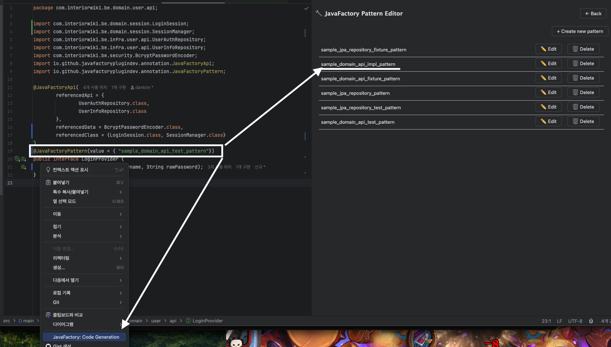

# JavaFactory IntelliJ Plugin

**JavaFactory** is an IntelliJ plugin that automates the generation of repetitive code in Java/Kotlin projects.  
Using LLM-based automation, it enables developers to define reusable patterns and generate code accordingly.


gpt-4o can generate 200–300 lines of code in 30 seconds,
and you only need to spend 30–50 seconds reviewing it to decide if it's ready to commit

If you follow the guide and create a well-structured prompt set as `Pattern`,
it can boost your productivity.

[Intellij Marketplace  Link](https://plugins.jetbrains.com/plugin/27246-javafactory)

## Key Features

1. Register and manage custom code generation patterns
2. Collect reference source code for prompt generation (via `@JavaFactory` annotations)

---

## Demo

### Generate Implementation & Test Code


### Generate Implementation Code Only


JavaFactory can automatically generate:

- Simple implementations
- Corresponding test classes
- Auxiliary code such as mappers and utility classes

All generation logic is customizable based on your defined patterns.

---

## How to Use

### 1. Add the Annotation Dependency

**Maven:**
```xml
<dependency>
    <groupId>io.github.javafactoryplugindev</groupId>
    <artifactId>javafactory-annotation</artifactId>
    <version>0.1.1</version>
</dependency>
```

**Gradle:**
```groovy
implementation 'io.github.javafactoryplugindev:javafactory-annotation:0.1.1'
```

### 2. Register Your OpenAI API Key

Open the plugin settings and enter your API key.


- The API key is Base64-encoded and stored as an XML file under the `.idea/` directory.
- Make sure to **add `.idea/` to your `.gitignore`:**

```
.idea
```

### 3. Right-click in the editor and select **“Code Generation”**


additional details about setting is [below]()!

---

## Additional Documentation

- [Collecting Referenced Classes](https://github.com/JavaFactoryPluginDev/javafactory-plugin/blob/master/docs/crawl_java_files.md)
- [Managing Patterns](https://github.com/JavaFactoryPluginDev/javafactory-plugin/blob/master/docs/patterns.md)
- [Usage examples](https://github.com/JavaFactoryPluginDev/javafactory-plugin/blob/master/docs/usage_example.md)


- [Intellij Marketplace  Link](https://plugins.jetbrains.com/plugin/27246-javafactory)
- [Ideas : Building an IntelliJ Code Generation Plugin with LLM](https://github.com/JavaFactoryPluginDev/javafactory-plugin/blob/master/docs/hackerNews/introduce.md)


---

### Detailed configuration 

#### mark references for compromising user prompt


When generating a domain API implementation, the user prompt must include the API source and related data specs to produce functioning code.

To enable the plugin to gather the necessary source files for each task, I defined custom annotations. During plugin execution, the plugin collects the required classes for each task based on these annotations.


You can find the exact collection rules at the link below:
Link: Reference Annotation Guide(https://github.com/JavaFactoryPluginDev/javafactory-plugin/blob/master/docs/crawl_java_files.md)


#### Define your repetitive tasks using natural language.

Since each developer has their own preferences and priorities, the definition of rules must be customizable.

For example, I prefer to keep tests in the infra layer as close to pure Java as possible. However, someone else might find such a rule excessive. Therefore, customization of these rules must be supported.


#### set patternName in your interface and run 




once you set pattens and annotation, set `@JavaFactoryPattern( value = "pattern_name" )` or `@JavaFactoryPattern( value = ["pattern_name1","pattern_name2" ] )`.
right-click your file and run generation.

