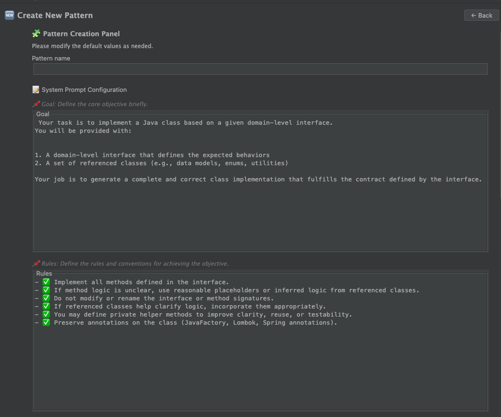

https://github.com/user-attachments/assets/31586a5e-a70c-4ca7-aae1-3f177767420a


# JavaFactory

JavaFactory is a tool that uses LLMs to automatically generate repetitive Java code.
It produces results that are more predictable and stable than those of traditional AI code generators.
JavaFactory operates based on two core components:

- Pattern Definition: Define each unit of work in natural language (e.g., test generation, implementation generation, etc.)

- Annotation-Based Reference Collection: Explicitly specify the required classes using annotations.

Once defined, these patterns can be reused repeatedly to generate various types of code — such as implementations, tests, and fixtures.
- 🔗 [JetBrains Marketplace](https://plugins.jetbrains.com/plugin/27246-javafactory)
- 📘  [How to use.](docs/how-to-use.md)
- 🛠 Install: IntelliJ > Settings > Plugins > Search: `JavaFactory`


## Demo: 400 Lines in 20s. All tests passed
> The following demo shows an example where 400 lines of code were generated, and all tests passed:

<a href="https://www.youtube.com/watch?v=ReBCXKOpW3M" target="_blank">
  
</a>

<br/>

## Key Features

### 1. Define units of work as patterns

<a href="https://www.youtube.com/watch?v=kqHGkCpoQz8" target="_blank">
  
</a>


Repetitive tasks can be defined as a single pattern.
A pattern clearly specifies what to generate, how to generate it, and which classes to reference.

A pattern consists of two main parts:

#### System Prompt


```plaintext
## Goal
{{ user_defined_goal }}

## Rules
{{ user_defined_rules }}

## Output
{{ expected_format }}

## Example
{{ typical_example_code }}
```

#### User Prompt

```text
<< {role_name1 } >>
{{ class source }}

<< {role_name1 } >>
{{ class source }}

....
```
<br/>

#### Edit Patterns
You can configure the System Prompt and User Prompt for each task,
and JavaFactory provides a dedicated UI for this purpose.

1. Edit system prompt configuration 



> Goal, Rules, Output, Example can be customized 

2. Edit user prompt configuration


> Determine which classes should be included in the user prompt.


<br/>

## 2. Annotation-Based Reference Collection

The classes to be used in a pattern are explicitly scoped using annotations.
When a class is annotated with a specific role, it will be automatically included if it matches the reference targets defined in the pattern.

Annotations are categorized into two main types:

- `@JavaFactoryData`
    - Recursively collects the classes specified in `referencedData`.
    - Example: Domain models, entities, and other data-related classes.

- `@JavaFactoryApi`
    - Collects only one level of `referencedApi`.
    -  Optionally allows specifying the implementation, test, and fixture classes for the API.
    - Example: API interfaces such as Reader, Writer, Validator.

You can explicitly control which classes are needed for code generation and how far the reference collection should go.


---

<br/>


## Recommended For

### Those who have been disappointed with traditional AI code generators

- If you've experienced unpredictable results or maintainability issues on former code generation 
- If you want more than just simple generation — you want to explicitly control the task unit and reference structure


### Developers working in repetitive, structured environments

- For example: Environments with repeating patterns like layered architecture
- Tasks like the following can be automated repeatedly after defining the rule once:

1. dao-repository-implementation
2. dao-repository-test
3. dao-repository-fixture
4. domain-api-implementation
5. domain-api-test
6. domain-api-fixture

> In such structures, I recommend designing the red boxes manually, and letting JavaFactory automate the blue boxes.


<br/>

