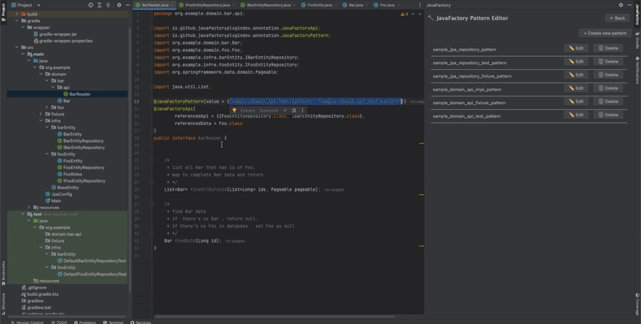
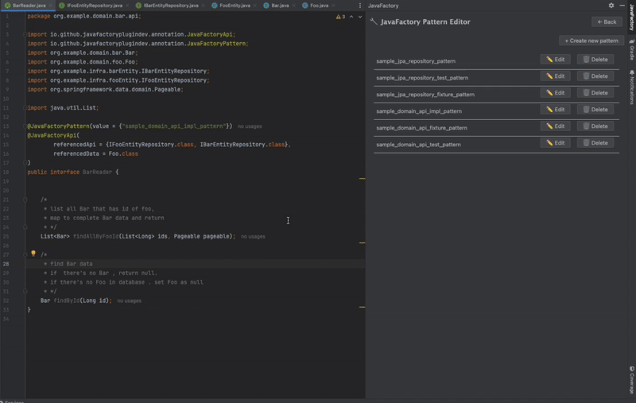
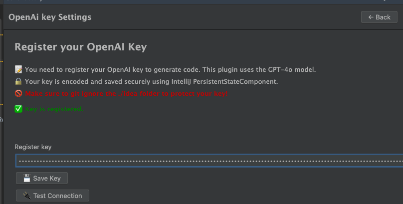
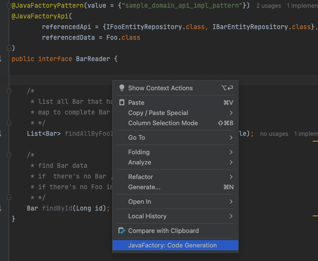

# JavaFactory IntelliJ Plugin

**JavaFactory** is an IntelliJ plugin that automates the generation of repetitive code in Java/Kotlin projects.  
Using LLM-based automation, it enables developers to define reusable patterns and generate code accordingly.

## Key Features

1. Register and manage custom code generation patterns
2. Collect reference source code for prompt generation (via `@JavaFactory` annotations)

---

## Demo

### Generate Implementation & Test Code


### Generate Implementation Code Only


JavaFactory can automatically generate:

- Simple implementations
- Corresponding test classes
- Auxiliary code such as mappers and utility classes

All generation logic is customizable based on your defined patterns.

---

## How to Use

### 1. Add the Annotation Dependency

**Maven:**
```xml
<dependency>
    <groupId>io.github.javafactoryplugindev</groupId>
    <artifactId>javafactory-annotation</artifactId>
    <version>0.1.1</version>
</dependency>
```

**Gradle:**
```groovy
implementation 'io.github.javafactoryplugindev:javafactory-annotation:0.1.1'
```

### 2. Register Your OpenAI API Key

Open the plugin settings and enter your API key.



- The API key is Base64-encoded and stored as an XML file under the `.idea/` directory.
- Make sure to **add `.idea/` to your `.gitignore`:**

```
.idea
```

### 3. Right-click in the editor and select **“Code Generation”**



---

## Additional Documentation

- [Collecting Referenced Classes](https://github.com/JavaFactoryPluginDev/javafactory-plugin/blob/master/docs/crawl_java_files.md)
- [Managing Patterns](https://github.com/JavaFactoryPluginDev/javafactory-plugin/blob/master/docs/patterns.md)
- [Usage examples](https://github.com/JavaFactoryPluginDev/javafactory-plugin/blob/master/docs/usage_example.md)
