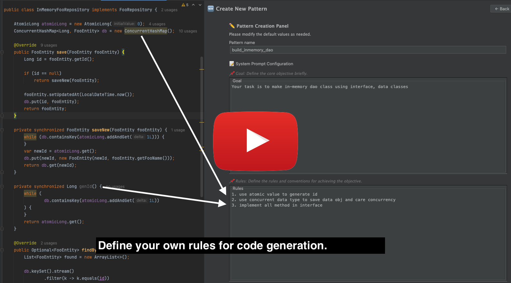
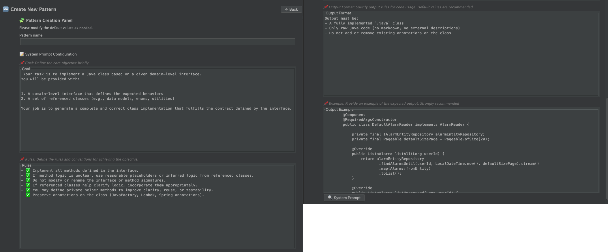
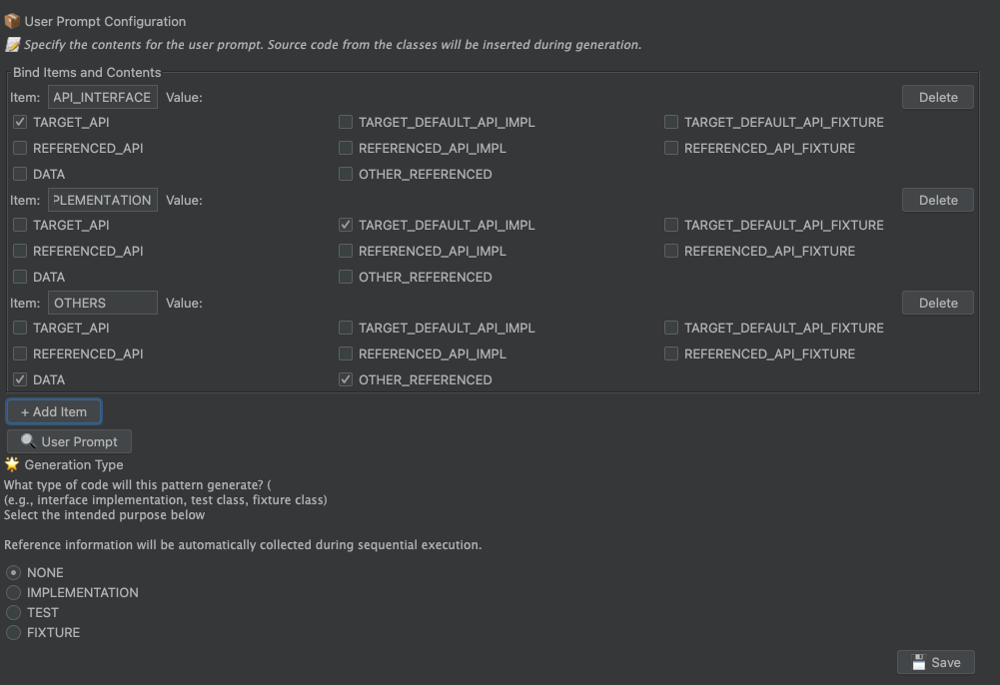
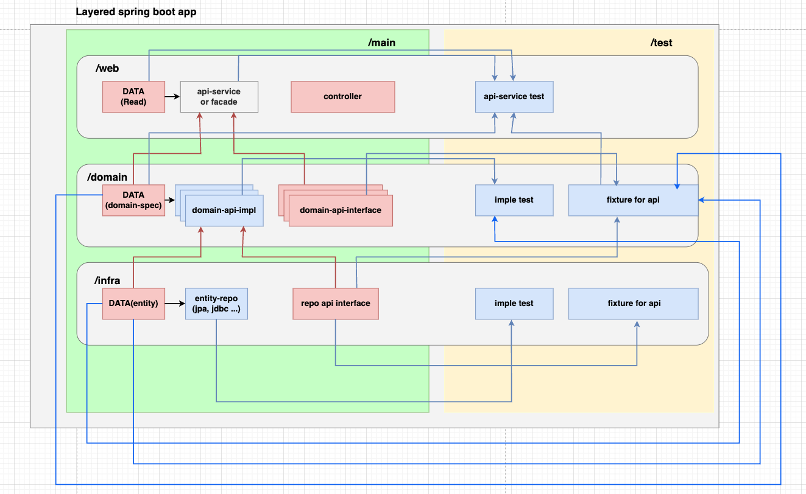

# JavaFactory

**JavaFactory**는 LLM을 이용해 반복적인 Java 코드를 자동 생성하는 도구입니다.  
작업 단위의 규칙과 참조 대상을 명확히 정의함으로써, 기존 AI 코드 제너레이터보다 예측 가능하고 안정적인 결과를 생성을 목표로 합니다.

JavaFactory는 다음 두 가지 구조로 동작합니다:

- **패턴 정의**: 자연어로 작업 단위를 정의합니다. (예: 테스트 생성, 구현체 생성 등)
- **어노테이션 수집**: 필요한 클래스를 명시적으로 지정합니다.

한 번 정의한 규칙은 반복적으로 재사용할 수 있으며,  
구현체, 테스트, 픽스처 등 다양한 코드생성을 패턴으로 생성할 수 있습니다.

  

- 🔗 [JetBrains Marketplace](https://plugins.jetbrains.com/plugin/27246-javafactory)
- 📘  [사용법 살펴보기.](docs/how-to-use.md)
- 🛠 설치: IntelliJ > Settings > Plugins > 검색: `JavaFactory`

> 아래 데모는 400줄의 코드가 생성되고, 모든 테스트를 통과한 예시입니다:

  

##  Demo : 400 Lines in 20s. All test passed

  

## 핵심 기능들

### 1. 작업 단위를 패턴으로 정의합니다

반복되는 작업은 하나의 `패턴`으로 정의할 수 있습니다.  
패턴은 "무엇을 어떻게 생성할지", "어떤 클래스를 참조할지"를 명확히 설정합니다.

패턴은 아래 두 파트로 구성됩니다:

- **System Prompt**
    - Goal: 작업 목적
    - Rules: 적용할 규칙
    - Output: 결과물 포맷
    - Example: 전형적인 예시 코드

- **User Prompt**
    - key-value 형태
    - user prompt 에 포함시킬 클래스 지정

  

#### User Prompt

유저 프롬프트 항목에 어떤 소스를 포함시킬지를 선택할 수 있습니다.
아래는 유저 프롬프트의 예시입니다.

> value 값이 어떻게 결정되는지는 `어노테이션 수집 규칙`에서 설명합니다.

  

## 2. 어노테이션 수집 규칙

패턴에서 사용할 클래스들은 어노테이션을 통해 명시적으로 범위가 제공됩니다.
각 클래스에 어노테이션으로 역할을 부여하면, 패턴에서 정의한 수집 대상과 일치하는 경우 자동으로 포함됩니다.

어노테이션은 크게 두 가지로 나뉩니다:

- `@JavaFactoryData`
    - `referencedData`에 명시된 클래스들을 **재귀적으로** 수집합니다.
    - 예: 도메인 모델, 엔티티 등 데이터 성격의 클래스

- `@JavaFactoryApi`
    - `referencedApi`와 `referencedData` 항목만 **1단계만** 수집합니다.
    -  해당 API의 구현체, 테스트, 픽스처를 옵션으로 함께 지정 가능
    - 예: Reader, Writer, Validator 등 API 인터페이스

코드 생성을 위해 어떤 클래스들이 필요하고, 어디까지 포함할지를 명시적으로 제어할 수 있습니다.

---

  

## 이런 사람에게 추천합니다

### 기존 AI 코드 제너레이터의 결과에 실망한 분

- 코드가 예측 불가능하거나, 유지보수가 어려웠던 경험이 있다면
- 단순한 생성이 아니라 **작업 단위와 참조 구조를 직접 통제**하고 싶은 분

### 정해진 구조에서 반복적인 개발을 많이 하는 분

- 예: Layered Architecture처럼 구조가 반복되는 환경
- 아래와 같은 작업들은 규칙 한 번 정의 후, 반복 생성이 가능합니다:

1. dao-repository-implementation
2. dao-repository-test
3. dao-repository-fixture
4. domain-api-implementation
5. domain-api-test
6. domain-api-fixture

> 구조상 “빨간 박스”만 사람이 설계하고,  
> “파란 박스”는 JavaFactory로 자동화 시도를 추천합니다

