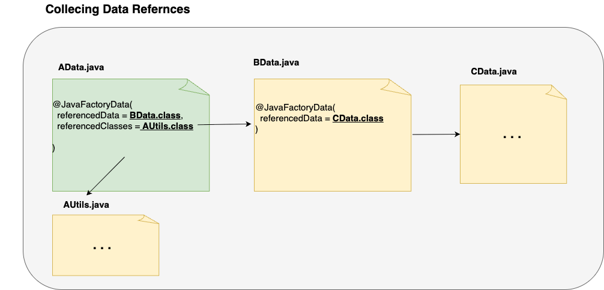

# JavaFactory Annotation-Based Reference Collection Rules


## Table of Contents

- [1. Overview](#1-overview)
- [2. Reference Collection Principle: Avoiding Implementation Chaining](#2-reference-collection-principle-avoiding-implementation-chaining)
    - [❌ Bad Example](#-bad-example)
    - [✅ Good Example](#-good-example)
- [3. Annotation Types and Spec Summary](#3-annotation-types-and-spec-summary)
    - [3.1 `@JavaFactoryPattern`](#31-javafactorypattern)
    - [3.2 `@JavaFactoryApi`](#32-javafactoryapi)
    - [3.3 `@JavaFactoryData`](#33-javafactorydata)
- [4. Reference Collection Rules](#4-reference-collection-rules)
    - [4.1 Data Class Collection (`@JavaFactoryData`)](#41-data-class-collection-javafactorydata)
        - [Example: Recursive Data Collection](#example-recursive-data-collection)
    - [4.2 API Interface Collection (`@JavaFactoryApi`)](#42-api-interface-collection-javafactoryapi)
        - [Example: API-based Collection Tree](#example-api-based-collection-tree)


## 1. Overview

This document describes the structure and collection rules for the `@JavaFactory` annotation family.

Annotations are used to collect reference classes required for code generation.  
For example, when generating an implementation class, you can use annotations to specify the required data classes or dependent APIs.

---

## 2. Reference Collection Principle: Avoiding Implementation Chaining

To improve LLM inference quality, JavaFactory aims to **minimize the number of referenced classes** included in the prompt for code generation.

Therefore, reference collection is based on **interfaces only**.  
(*It is strongly recommended to adopt interface-oriented design when using this plugin.*)

### ❌ Bad Example


- If you gather references from implementations, it's hard to decide where to stop.

### ✅ Good Example


- Only reference interfaces — no need to recursively include all implementations.

---

## 3. Annotation Types and Specs

JavaFactory provides three types of annotations to control reference collection behavior.  
Each annotation defines what kind of classes are collected and how.

### 3.1 `@JavaFactoryPattern`

- Identifies the applicable code generation pattern.
- Not involved in reference collection. It is used only to determine the pattern used for code generation.

```java
@JavaFactoryPattern({"IMPLEMENTATION", "TEST"})
public interface MyApi { ... }
```

### 3.2 `@JavaFactoryApi`

| Field            | Purpose                                  | Required |
|------------------|-------------------------------------------|----------|
| `defaultImpl`     | Default implementation class              | Optional |
| `defaultFixture`  | Fixture (test) implementation             | Optional |
| `referencedData`  | Associated domain data classes            | Optional |
| `referencedApi`   | Dependent API interfaces                  | Optional |
| `referencedClass` | Utility/helper classes (e.g., enums, DTOs)| Optional |

### 3.3 `@JavaFactoryData`

| Field            | Purpose                             | Required |
|------------------|--------------------------------------|----------|
| `referencedData`  | Related data classes                 | Optional |
| `referencedClass` | Helper classes (e.g., DTO, enum)     | Optional |

- If no annotation is present, only the class itself is collected.
- Cycles are avoided by automatically deduplicating references.

---

## 4. Reference Collection Rules

JavaFactory performs static reference collection based on the information declared in annotations.  
The way references are collected varies depending on the annotation type.

### 4.1 Data Class Collection (`@JavaFactoryData`)

- `referencedData` is collected **recursively**.
- `referencedClass` is collected as **direct references only** (non-recursive).
- If no annotation is present, only the class itself is collected.

#### Example: Recursive Data Collection

```
AData
 ├── BData
 │    └── CData
 └── AUtils
```


---

### 4.2 API Interface Collection (`@JavaFactoryApi`)

API collection starts from classes annotated with `@JavaFactoryApi`.

The following elements are collected from the annotated class:

- `defaultImpl`: Default implementation class
- `defaultFixture`: Test fixture class
- `referencedData`: Referenced data classes (→ recursively collected)
- `referencedApi`: Other referenced APIs (→ one level deep only)
- `referencedClass`: Utility/helper classes (non-recursive)

If a `referencedApi` points to another class with `@JavaFactoryApi`,  
then that class’s implementation, fixture, data, and helper classes are also collected.  
This collection does **not** continue recursively beyond one level. See the diagram below.

#### Example: API-Based Reference Tree

```
AReader
├── defaultImpl: DefaultAReader
├── referencedData: AData (→ BData → CData)  ✅ recursively collected
├── referencedApi:
│    ├── AEntityRepository → DefaultAEntityRepository, AEntity
│    └── BEntityRepository → DefaultBEntityRepository, BEntity
└── referencedClass: AUtils
```


## Additional Documentation

- [Collecting Referenced Classes](https://github.com/JavaFactoryPluginDev/javafactory-plugin/blob/master/docs/crawl_java_files.md)
- [Managing Patterns](https://github.com/JavaFactoryPluginDev/javafactory-plugin/blob/master/docs/patterns.md)
- [Usage examples](https://github.com/JavaFactoryPluginDev/javafactory-plugin/blob/master/docs/usage_example.md)
