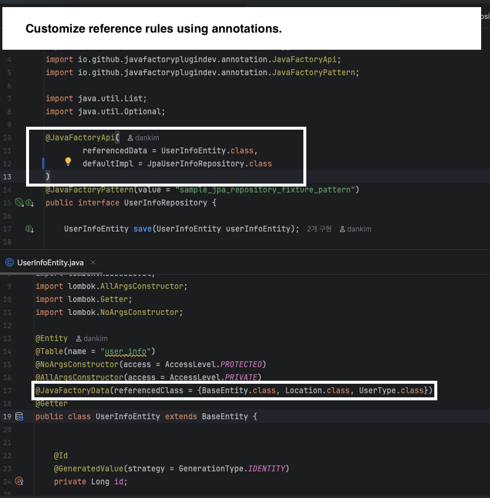
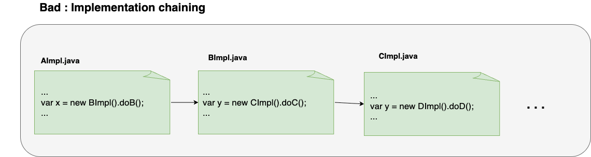
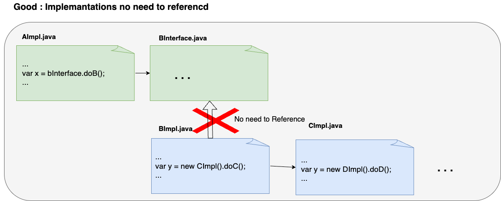

# Building an IntelliJ Code Generation Plugin with LLM


## Overview

This project started with the idea of expanding the scope of automation.

As LLMs have advanced, tasks that can be defined with natural language rules have become candidates for automation.

This document records the experiments I conducted to reduce effort in daily tasks, along with the insights gained from them.


## What to Automate

Once the API interfaces and data specs are defined, it becomes possible to generate tests, implementations, and fixtures.


The image above represents the layered architecture as I see it.

In my case, once the components inside the red box are defined, I found that each of the blue parts can be generated via LLM—provided that roughly one or two pages of A4-sized rules and appropriate reference classes are available.

I experimented with this idea by building a simple Python CLI, which helped reduce effort across an API project of about 7,000 lines.

After refining some aspects of that experiment, I developed it into an IntelliJ plugin.


## Python CLI Demo for Validation

This is a demo from the initial version, created to validate the core hypothesis.


## What Features Will It Provide?

### 1. Define each user’s repetitive tasks using natural language.

Since each developer has their own preferences and priorities, the definition of rules must be customizable.

For example, I prefer to keep tests in the infra layer as close to pure Java as possible. However, someone else might find such a rule excessive. Therefore, customization of these rules must be supported.


Below is the actual system prompt I use to generate test code for a domain API.

```text
## Goal

Write a unit test class for the given domain implementation class,

You will be provided with:

1. A domain-level interface that defines the expected behaviors

2. The implementation class of the interface

3. Fixtures for dependency injection (DI)

4. A set of referenced classes (e.g., data models, enums, utilities)

## Rules

- Write test methods for every method declared in the interface.

- Each test cover at least one success case and optionally edge/failure cases.

- Inject fixture objects when instantiating the implementation class. (Fake... class if possible)

- Use pure Java with JUnit 5.

- Annotate each test with @DisplayName using Korean to describe the test purpose.

- Do not invent helper methods, factories, or mock behavior beyond what is defined.

## Output Format

Return only:

- One complete .java class

- No markdown

- No external explanations or comments

## Output Example

class DefaultUserReaderTest {

private UserAuthRepository userAuthRepository;

private UserInfoRepository userInfoRepository;

private DefaultUserReader userReader;

@BeforeEach

void setup() {

userAuthRepository = FakeUserAuthRepository.getInstance();

userInfoRepository = FakeUserInfoRepository.getInstance();

userReader = new DefaultUserReader(userAuthRepository, userInfoRepository);

}

@Test

@DisplayName("read(Long userId) with valid userId should return User")

void readById_whenValidUserId_thenReturnUser() {

var authInfo = userAuthRepository.save(UserAuthEntity.of(

1L,

"username",

"pw",

Set.of(UserRole.NORMAL)

));

var userInfo = userInfoRepository.save(UserInfoEntity.of(

1L,

1L,

Location.EUNPYUNG,

UserType.USER

));

var user = userReader.read(authInfo.getId());

assertNotNull(user);

assertEquals(user.getId(), authInfo.getId());

assertEquals(user.getNickname(), authInfo.getUsername());

assertEquals(user.getUserType(), userInfo.getUserType());

assertEquals(user.getLocation(), userInfo.getLocation());

assertTrue(user.getRoles().contains(UserRole.NORMAL));

}

@Test

@DisplayName("read(Long userId) with invalid userId should return null")

void readById_whenInvalidUserId_thenReturnNull() {


var userNoExist = userReader.read(Long.MAX_VALUE);

assertNull(userNoExist);

}


}

```


### 2. Reference Collection

When generating a domain API implementation, the user prompt must include the API source and related data specs to produce functioning code.

To enable the plugin to gather the necessary source files for each task, I defined custom annotations. During plugin execution, the plugin collects the required classes for each task based on these annotations.



You can find the exact collection rules at the link below:
Link: Reference Annotation Guide(https://github.com/JavaFactoryPluginDev/javafactory-plugin/blob/master/docs/crawl_java_files.md)


## Insight


### 1. LLMs prefer interfaces.

Below is the rule I established while defining the class collection logic.

Whenever possible, I generate functionality based on interfaces and collect references at the interface level.

- bad example : can not decide when to stop 


- good example : only 1 depth



When using implementation classes, it's unclear where to stop the reference chain.
On the other hand, data classes should be collected recursively.

If you're planning to build a similar system, I recommend basing your rules around interfaces.

If you know of any mechanism that can infer and collect the necessary references without relying on annotations or predefined rules, I’d love to hear about it.


### 2. if there's a pattern, it's worth attempting automation. It may sound cliché, but a lot of work is becoming hands-free.

I use this tool when starting new freelance projects.
Within a limited scope, it generates 200–300 lines of code in about 30 seconds. After a one-minute review, I can commit it — it's quite convenient.

I don’t have deep expertise in LLMs.
Still, just by “defining patterns,” “establishing collection rules,” and “passing it to the LLM,” I’ve seen clear value.

If experts were to formalize this approach, it could automate a large portion of what is currently done by hand.
I genuinely think this is a highly promising field. (want to join if possible)


Rather than focusing on abstract reasoning, I think building practical business tools is more impactful.
Complex reasoning currently requires models more than GPT-4o to get usable results. Since it's very expensive, a cleaner business model would involve having paid users invoke GPT only at key moments.


----

### Add demo (example of generating test and implementation)


---


If you take a look around, I recommend starting with the main [README](https://github.com/JavaFactoryPluginDev/javafactory-plugin/tree/master).
It includes a list of related documents at the bottom.

This project welcomes all feedback. You can leave your thoughts in the [Discussions tab](https://github.com/JavaFactoryPluginDev/javafactory-plugin/discussions) — it would be greatly appreciated.
