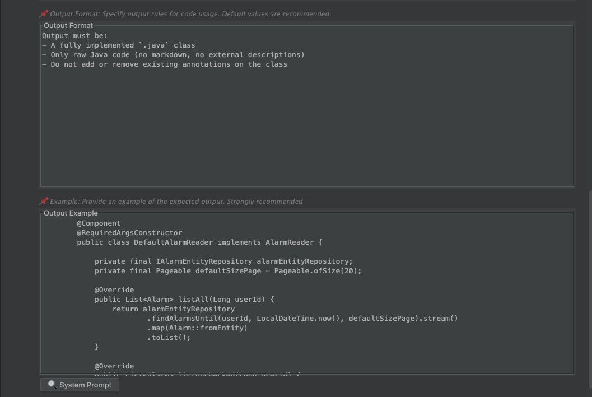
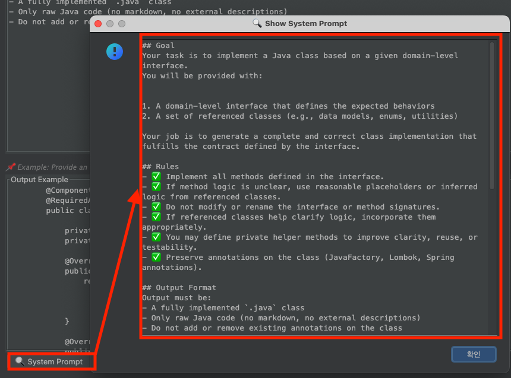
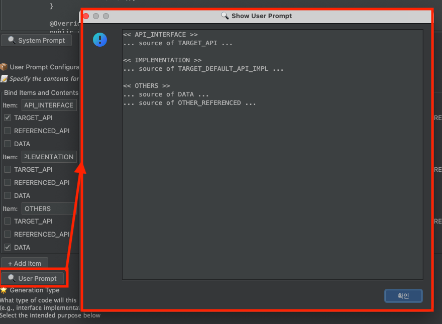

# JavaFactory Pattern Guide

## Table of Contents

- [1. Overview](#1-overview)
- [2. Structure of LLM Prompt](#2-structure-of-llm-prompt)
    - [Example](#example)
- [3. Pattern Creation Panel](#3-pattern-creation-panel)
    - [System Prompt Fields](#system-prompt-fields)
        - [Best Practices for System Prompt](#best-practices-for-system-prompt)
        - [Preview](#preview)
    - [User Prompt](#user-prompt)
        - [Example User Prompt](#example-user-prompt)
    - 
## 1. Overview

A **pattern** in JavaFactory is a set of instructions that guides the LLM on how to generate code.  
It allows users to customize what kind of code should be created and how, depending on their environment and needs.

For example:
- If you want to automate test code generation, you can define a pattern for test creation.
- If your goal is to automate mapper class creation, you can define a pattern accordingly.

Patterns provide flexibility to define reusable and domain-specific automation logic.

---

## 2. Structure of LLM Prompt

JavaFactory uses two parts to construct prompts sent to the LLM:

- **System Prompt**: Describes the task, goal, rules, and output format.
- **User Prompt**: Injects real-time user input (e.g., target interface, implementation, related classes).

This structure ensures modular, reusable instruction while enabling highly customized generation.

### Example

Here is a simplified example for users new to LLM-based workflows:

```
## Goal 
Your task is to write test code for a given domain-level API.

You will receive:
 - An API interface
 - The implementation class of the interface
 - Additional required classes like data models or utilities

## Rules

1. Write test cases for all methods defined in the interface.
2. Cover both success and failure scenarios.

## Output

A complete Java file as output.

## Example
...
```

```
<< API INTERFACE >>

...

<< API IMPLEMENTATION >>

...

<< OTHER CLASSES >>

...
```


## 3. Pattern Creation Panel

You can define and edit patterns from the Pattern Creation panel.

Default template values are provided. You can adjust them to suit your automation goals.

### System Prompt Fields

- **goal**: What to do
- **rules**: How to do it
- **output**: Expected output format
- **example**: Optional example

#### Best Practices for System Prompt

1. Keep the `output` format consistent to maintain stable results.
2. Avoid overly detailed examples, which may cause biased completions. Instead, consider using commented templates like this:

```java
public class FooImpl {
    Foo read(Long id) {
        // ... read and return using public method of given classes ...
    }
}
```

#### Preview

You can preview how your system prompt will look before saving it.

  
  


---

### User Prompt

User prompt is defined in key-value format.

JavaFactory will automatically insert real-time values (e.g., source code of selected classes) into your template.

#### Example User Prompt

To define the same user prompt as in the example above, use:

```
<< API INTERFACE >>

...

<< API IMPLEMENTATION >>

...

<< OTHER CLASSES >>

...
```

  



----

<br/>

<br/>


## Additional Documentation

- [Collecting Referenced Classes](https://github.com/JavaFactoryPluginDev/javafactory-plugin/blob/master/docs/crawl_java_files.md)
- [Managing Patterns](https://github.com/JavaFactoryPluginDev/javafactory-plugin/blob/master/docs/patterns.md)
- [Usage examples](https://github.com/JavaFactoryPluginDev/javafactory-plugin/blob/master/docs/usage_example.md)
