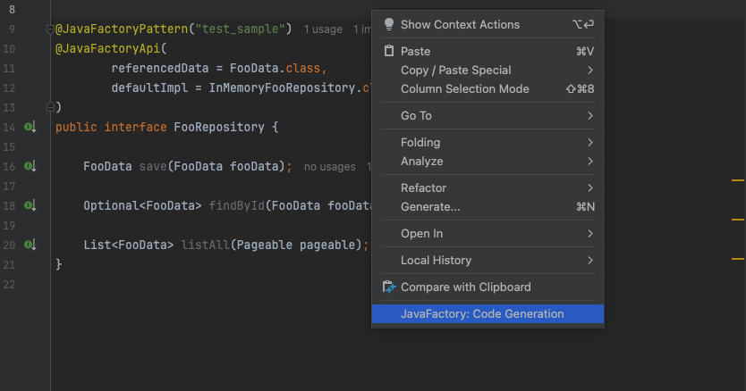

# Pattern Example Usage

## Table of Contents
- [Overview](#overview)
- [Java Code Annotation Setup](#java-code-annotation-setup)
- [User Prompt Definition](#user-prompt-definition)
- [System Prompt Example](#system-prompt-example)
- [Running the Pattern](#running-the-pattern)

---

## Overview

This section provides a real-world example of using JavaFactory to automatically generate test code for a domain-level API.  
We assume you already have the API and its implementation ready.

Required steps:
1. Define a pattern
2. Annotate related Java classes with `@JavaFactory*` annotations

---

## Java Code Annotation Setup

### 1. Data
```java
public class FooData {
    private Long id;
    private String name;

    public FooData(Long id, String name) {
        this.id = id;
        this.name = name;
    }
    // Getters and setters omitted for brevity
}
```

### 2. API Interface
```java
@JavaFactoryPattern("sample_domain_api_impl_pattern")
@JavaFactoryApi(
        referencedData = FooData.class,
        defaultImpl = InMemoryFooRepository.class
)
public interface FooRepository {
    FooData save(FooData fooData);
    Optional<FooData> findById(FooData fooData);
    List<FooData> listAll(Pageable pageable);
}
```

### 3. Implementation
```java
public class InMemoryFooRepository implements FooRepository {
    private final Map<Long, FooData> storage = new HashMap<>();
    private final AtomicLong idGenerator = new AtomicLong();

    @Override
    public FooData save(FooData fooData) {
        // simplified save logic
    }

    @Override
    public Optional<FooData> findById(FooData fooData) {
        return Optional.ofNullable(storage.get(fooData.getId()));
    }

    @Override
    public List<FooData> listAll(Pageable pageable) {
        // simplified paging logic
    }
}
```

---

## User Prompt Definition

To include content in the prompt in the order you want, you can define the prompt like this:

```java
<< API INTERFACE >>

        ... source of api ...

<< API IMPLEMENTATION >>

        ... source of implementation ... 

<< DATA >> 

        ... source of data ...
```


---

## System Prompt Example

```java
## Goal
Your task is to write test code. 
Make sure to generate realistic, pure Java test code for the interface.

You are given:

1. Interface 
2. Implementation 
3. Data classes 

## Rules
- ✅ Write test cases for all methods defined in the interface.
- ✅ Cover both success and failure cases.
- ✅ Use only public methods of given classes, don't invent setters/getters.
- ✅ Use JUnit 5.
- ✅ Write @DisplayName for each test.

## Output
A fully implemented `.java` class, raw Java code only.

## Output Example
public class FooTest {
    FooReader fooReader;

    @BeforeEach
    public void setUp() {
        fooReader = new FooReader();
    }

    @Test
    @DisplayName("Fail case of doA()")  
    void doA_fail() {
        // fail case
    } 	

    @Test 
    @DisplayName("Success case of doA()")  
    void doA_success() {
        // success case
    }
}
```

---

## Running the Pattern



### Result: Generated Test Code
```java
public class InMemoryFooRepositoryTest {
    private FooRepository fooRepository;

    @BeforeEach
    public void setUp() {
        fooRepository = new InMemoryFooRepository();
    }

    @Test
    @DisplayName("Successfully save a new FooData")
    void save_success() {
        // test logic...
    }

    @Test
    @DisplayName("Successfully update an existing FooData")
    void save_updateSuccess() {
        // test logic...
    }

    @Test
    @DisplayName("Successful findById when FooData exists")
    void findById_success() {
        // test logic...
    }

    @Test
    @DisplayName("Failed findById when FooData does not exist")
    void findById_failure() {
        // test logic...
    }

    @Test
    @DisplayName("List all FooData with pagination")
    void listAll_success() {
        // test logic...
    }

    @Test
    @DisplayName("List all FooData with pagination - page out of bounds")
    void listAll_pageOutOfBounds() {
        // test logic...
    }
}
```


----

<br/>

<br/>


## Additional Documentation

- [Collecting Referenced Classes](https://github.com/JavaFactoryPluginDev/javafactory-plugin/blob/master/docs/crawl_java_files.md)
- [Managing Patterns](https://github.com/JavaFactoryPluginDev/javafactory-plugin/blob/master/docs/patterns.md)
- [Usage examples](https://github.com/JavaFactoryPluginDev/javafactory-plugin/blob/master/docs/usage_example.md)
